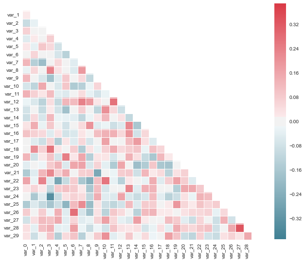

# Important Data Visualization Demo in Data Science

Histogram


Curve Fitting


Feature Importance
- Relative Feature Importance


Principal Component Analysis
- Variance Explained


Correlation

```python
import numpy as np
import seaborn as sns
import matplotlib.pyplot as plt
sns.set(style="darkgrid")

rs = np.random.RandomState(33)
d = rs.normal(size=(100, 30))

f, ax = plt.subplots(figsize=(9, 9))
cmap = sns.diverging_palette(220, 10, as_cmap=True)
sns.corrplot(d, annot=False, sig_stars=False,
             diag_names=False, cmap=cmap, ax=ax)
f.tight_layout()
```



Decision Boundary


Time Series
